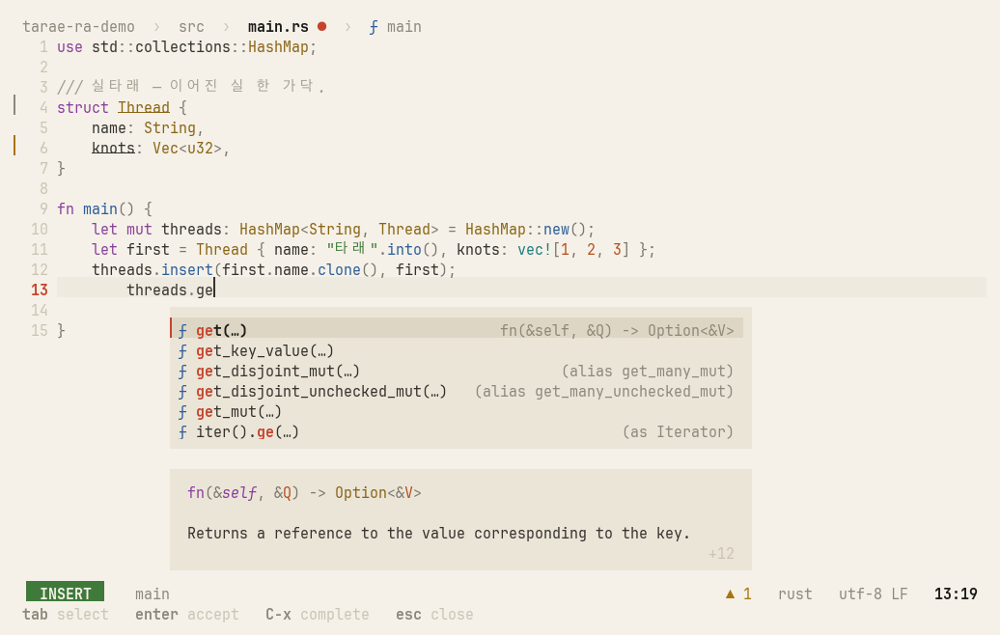

# tarae (타래)

> *Tarae* is a skein of thread — wound on from the feel of Helix, spun from fresh yarn.

<p align="center">
  
  
</p>

tarae is a terminal editor that keeps **Helix's keymap, its selection → action grammar, and its batteries-included spirit** —
and rebuilds everything else to fix what bothered us about Helix. It is not a fork.

| Helix pain point | tarae |
|---|---|
| Settings are a chore to change | One TOML file, applied on save; `:set` at runtime with descriptions and completion |
| Slow when a language server attaches | Keystrokes and rendering never wait — LSP, parsing, disk, and git all run in the background |
| No LLM support | Select → instruct → diff review, a chat panel, and Claude Code integration, built in |
| Immature plugins | Features go straight into the core (plugins are [on hold](docs/architecture.md#plugins--on-hold)) |

## Quick start

```sh
git clone https://github.com/eth219/tarae && cd tarae
cargo install --path .                               # Rust 1.90+ and a C compiler
# cargo install --path . --features bundled-grammars # or: 26 common grammars built in, nothing to download later
tarae path/to/file
```

No need to learn the keys first:

- **`space ?`** — command palette: find any command by what it does, with its key on the right ([screenshot](docs/screenshots/ux-palette.png))
- **which-key** — press `space`, `g`, `m`, `[`, or `]` and a card shows what comes next ([screenshot](docs/screenshots/ux-which-key.png))
- **`:tutor`** — a 10-minute hands-on tutorial in a practice buffer ([screenshot](docs/screenshots/ux-tutor.png))
- **Start screen** — launched without a file, it shows first steps and recent files ([screenshot](docs/screenshots/ux-welcome.png))

Rust, TOML, and Markdown are highlighted out of the box. Open a file in any other language and tarae offers to download its grammar — press `y`.

### Platform support

macOS and Linux. Windows isn't supported natively — tarae relies on Unix process and terminal APIs — but it runs under
WSL like on any Linux, and `space y`/`space p` use the Windows clipboard there. Language servers, test runners, and
debuggers are the usual external tools: see [Language support](docs/languages.md) for what each language needs.

## Highlights

- **Never makes you wait.** Worst key → frame on a 200k-line file: 1.0 ms debug, 52 µs release (budget 16 ms, enforced by a test).
  A 100 MB file shows its first screen in 18 ms.
- **Claude as a verb.** Select, `space i`, type an instruction — the answer streams in and lands as an in-buffer diff you accept change by change.
- **Claude Code knows your editor.** The `claude` in a side pane sees your selection and diagnostics, and its edits arrive in tarae for review.
- **Language tooling included.** LSP (completion, signature help, inlay hints, code actions with a diff preview, rename),
  plus a test runner and debugger for Rust, Go, Python, and Java — including attaching to remote programs.
- **Made to be looked at.** Two themes, meok (ink) and hanji (paper), picked from your terminal's background. Everything floating is a card
  that speaks the same color language as the code.

## What's inside

| Area | In short |
|---|---|
| [Editing](docs/features.md#editing) | Helix keys and command names, multiple cursors, regex selection, tree-sitter text objects, surround, registers, macros |
| [Look and feel](docs/features.md#look-and-feel) | meok and hanji themes, cards, path bar, status line, toasts, rendered doc comments, indent guides |
| [Getting around](docs/features.md#getting-around) | Fuzzy pickers with preview, global search, live search highlighting, split windows, `:` completion |
| [Files and git](docs/features.md#files-and-git) | Disk sync without losing undo, auto-save, session restore, persistent undo, git gutter |
| [Syntax highlighting](docs/features.md#syntax-highlighting) | Tree-sitter for 54 languages, grammars offered on first open, injections |
| [Language servers](docs/features.md#language-servers) | Diagnostics, completion, signature help, inlay hints, code actions with a diff preview, rename, symbols — and [Java](docs/features.md#java) via jdtls |
| [Tests](docs/testing-and-debugging.md#tests) | Run or debug the test at the cursor; failures marked on their line — Rust, Go, Python, Java |
| [Debugger](docs/testing-and-debugging.md#debugger) | DAP for Rust, C/C++, Go, Python, Java — inline values, conditions, logpoints, watches, [attach](docs/testing-and-debugging.md#attaching-to-a-running-program) |
| [Claude](docs/claude-integration.md) | Select → instruct → diff, a chat panel with your code as context, Claude Code in a side pane |


## Configuration

`~/.config/tarae/config.toml`, plus an optional project `.tarae.toml`. It's plain TOML, applied on save, and a
setting's name is its `:set` path — `:set editor.scrolloff 8` for this session, `:set!` to also write it to the file.

```toml
theme = "default"          # meok · hanji · …-transparent · default (follows the terminal)

[editor]
auto-save = "idle"         # "focus" · "idle" · "off"

[keys.normal]
"A-," = "goto_previous_buffer"
```

More in the [configuration guide](docs/configuration.md); every setting is in the [settings reference](docs/reference/settings.md).

## Documentation

- [Features](docs/features.md) — editing, look and feel, navigation, files and git, syntax, language servers, Java
- [Tests and debugging](docs/testing-and-debugging.md) — test runner, debugger, attaching to running programs
- [Claude](docs/claude-integration.md) — select → instruct → diff, chat panel, Claude Code integration
- [Language support](docs/languages.md) — language servers, test runners, and debuggers per language
- [Configuration](docs/configuration.md) — files and layers, `:set`, keys, language servers, custom themes
- Reference (generated from the code): [settings](docs/reference/settings.md) · [default keymap and `:` commands](docs/reference/keymap.md)
- [Architecture](docs/architecture.md) — principles, design language, roadmap, source layout
- [Contributing](CONTRIBUTING.md) — how to build, test, and send changes

## License

[MPL-2.0](LICENSE), the same license as Helix. The query files in `runtime/queries/` come from Helix
(MPL-2.0, see [NOTICE](runtime/queries/NOTICE)); grammar sources in `runtime/grammars.tar.gz` keep their upstream licenses.
