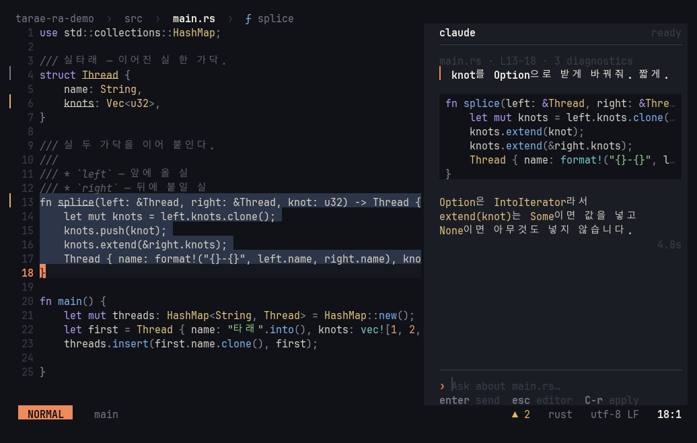
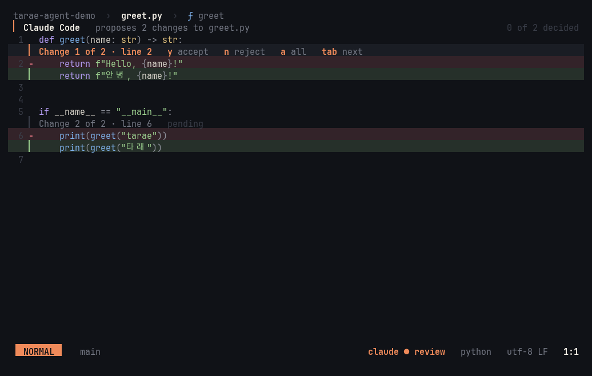

# Claude

tarae works with Claude in two ways: it asks Claude itself (edit a selection, or chat in a side panel), and it lets the
Claude Code you already run in a terminal pane see and edit what's in the editor.

tarae runs the `claude` CLI as a subprocess — there's no HTTP client, SDK, or API key in the editor; it uses your
Claude Code login as it is. You need [Claude Code](https://claude.com/claude-code) installed and
logged in.

- [Select → instruct → diff](#select--instruct--diff)
- [Chat panel](#chat-panel) — [follow mode](#follow-mode), [notes](#notes)
- [Claude Code integration](#claude-code-integration)
- [Settings](#settings)

## Select → instruct → diff

In a selection-first editor, Claude takes the *action* slot: select, then tell it what to do.

1. Select one or more pieces of text (multiple cursors work — Claude answers for each selection)
2. `space i` (or `:ask <instruction>`) and type the instruction
3. The answer streams into a card at the bottom right (thinking/writing, elapsed time) while you keep editing
4. It opens as an **in-buffer review**: the whole file stays in view with only the changed spots expanded — deleted
   lines on faint red, added lines on faint green, both in the file's syntax colors, a header line per change

| Key | In the review |
|---|---|
| `y` / `n` | Accept / reject this change |
| `a` | Accept all |
| `q` | Reject the rest |
| `tab` | Next change |
| `j` / `k` | Scroll |

Accepted changes apply as one transaction — one `u` undoes them all. If the original text moved while you waited, it's
found again and the change still lands in the right place. `:ask-cancel` kills the process, so token generation stops
too ([screenshot](screenshots/m4-review.png)).

**Speed**: a fresh `claude` process takes 8–10 s to start, so tarae starts one the moment the prompt opens, while you
type. Enter → diff takes about 3.4 s with the default model.

## Chat panel



`space l` (or `:chat [question]`) opens a panel on the right; `space L` closes it and `:chat-new` starts over. One
process lives for the whole conversation, so Claude remembers what came before.

Every message carries **the current file, cursor, selection, and diagnostics** as context — the whole file only the
first time a version is sent, and just the area around the cursor for files over 60 KB. What was sent shows as chips
above your message (`main.rs · L13–18 · 3 diagnostics`). Answers render as Markdown, with code blocks in their
language's colors.

Claude isn't limited to that file: it **explores the project itself** with read-only tools (Read, Grep, Glob — it
can't edit anything). Each lookup shows as a quiet row (`◦ read  src/lib.rs  L10–49`, `◦ search  fn add  in src`),
the one in progress marked `●`. The other open files are listed in the context, and unsaved ones send their text,
since Claude would otherwise read the stale copy on disk. Answers cite code as `path:line`. Those references are
underlined, and a click opens them. `C-g` walks every place the conversation points at, newest first, centering
each one while the chat keeps the keys.

| Key | In the chat |
|---|---|
| `enter` | Send |
| `alt-enter` / `C-j` | New line |
| `C-c` | Stop the answer (the conversation stays) |
| `C-r` | Replace the selection with the answer's code — through the same review |
| `C-y` | Copy the code |
| `C-g` | Go to where Claude looked or pointed (again = one further back) |
| `C-f` | Follow mode on/off (resumes if you took over) |
| `C-l` | New conversation |
| `esc` | Back to the editor |

### Follow mode

Follow is on by default (`C-f` in the chat toggles it; `llm.follow = false` starts with it off). The editor goes
where Claude is reading while it works. Each file it reads opens with the cursor on the first line read, centered, and those lines
get a faint accent wash. A search jumps to its first hit, and the finished answer takes you to its first
`path:line`. A card beside the code shows what Claude is doing (`● reading  src/llm.rs  L230–249`) and its latest
thinking. Claude's thinking arrives as summaries, and the chat keeps each one as a folded italic aside. While
Claude works, the chat minimizes to a small card at the bottom right: your question, its last few lookups
(each a link) and the keys. The code gets the whole width, and the thought card takes the room above the lines
being read. The panel comes back with the finished answer, or right away with `space l` or a click on the card.

Files opened along the way are previews: unedited ones close when follow moves on. Moving the cursor, switching
files, or scrolling in the editor takes over: following pauses (`claude › paused`) until `C-f` or your next
question. `C-o` jumps back to where you were before the turn.

An empty conversation shows a short guide and example questions you can pick with `tab`
([hanji theme](screenshots/m4-chat-hanji.png)).

### Notes

Claude can pin **notes** to lines of code: a bug, a risk, or a question tied to specific lines. A note shows as
`¶ first words` at the end of its line, and with the cursor on those lines a card shows the whole thread. Notes
ride edits (lines added above push them down) and last for the session.

Talk back right there: `space n` on a note line replies. Your reply goes to Claude together with those lines and
the thread so far, and Claude answers on the thread. `space n` on a line without a note asks Claude about that
line (or the selected lines), which starts a new note with your question.

| Key | Notes |
|---|---|
| `space n` | Reply to the note here, or ask Claude about this line |
| `]n` / `[n` | Next / previous note, across files (notes sharing a line one by one) |
| `space N` | Every note, with a preview |
| `:note-close` / `:notes-clear` | Close the note here / all of them |

When several notes share a line, the line end says how many (`¶ 3 notes · …`). The card shows one at a time
(`note 2 of 3 here`), and `]n` reads them in order. Floating cards never cover each other. The note at the
cursor is placed first, the minimized chat takes a free corner, and the thought card takes what's left. On a
small screen, a card with no room waits for the next frame that has room.

Under the hood the chat process gets tarae's own `note` tool: an MCP server that lives inside tarae and speaks
over the same stream as the conversation, so no server or port is involved.

## Claude Code integration



tarae speaks Claude Code's IDE protocol — the same one the VS Code and JetBrains extensions use (MCP over WebSocket) —
so there's nothing to set up on the Claude Code side.

- `space c` launches `claude` in a zellij or tmux side pane, already connected. A `claude` you already have running
  connects with `/ide` → tarae. Once connected, the status line shows `◦ claude code`
  ([screenshot](screenshots/m5-agent-connected.png))
- Claude sees your current selection (updated as it changes — its input shows `⧉ 1 line selected`), your open files
  and unsaved edits, and language-server diagnostics, so "fix this error" just works
- `space C` inserts the selected lines into Claude's input as `@file#L10-20`
- **Claude's edits come to you**: when it proposes an edit, tarae opens the file in the same in-buffer review as
  `space i`, headed `Claude Code`. `y`/`n` per change, `a` for all. Accept only part and Claude knows what you kept; it
  writes the file, and tarae treats that content arriving on disk as saved. A terminal bell gets your attention
- Security: tarae listens only on `127.0.0.1` and checks a per-session 128-bit token (from `~/.claude/ide/<port>.lock`).
  Turn it off with `llm.claude-code = false`

## Settings

```toml
[llm]
command = "claude"   # a CLI speaking Claude Code's stream-json protocol
model = "haiku"      # "" = the CLI's default model
context-lines = 20   # lines around each selection sent along
claude-code = true   # let Claude Code connect (restart to apply)
```

All of them, with defaults: [settings reference](reference/settings.md#llm).
