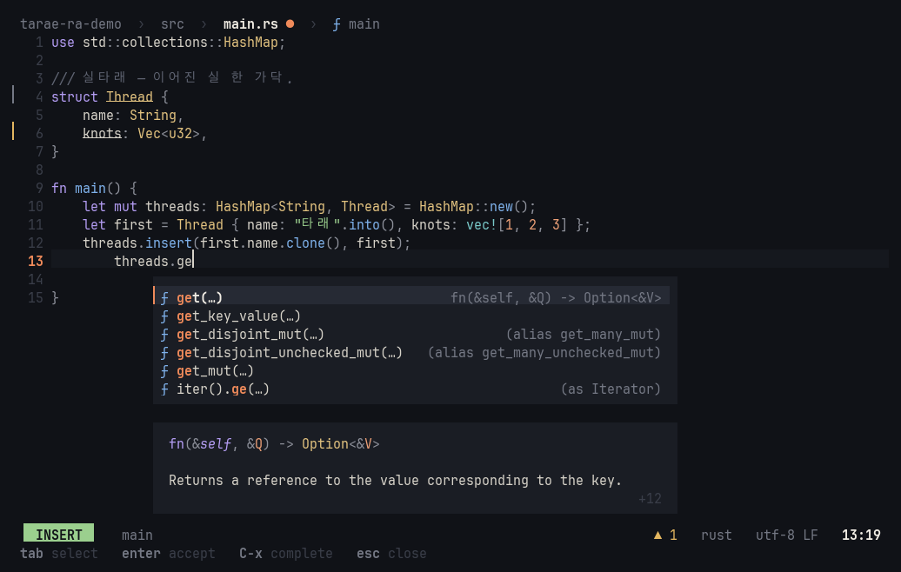

# Features

A tour of what tarae does. Every key is listed in the [default keymap](reference/keymap.md); every setting in the
[settings reference](reference/settings.md). Tests and the debugger have [their own page](testing-and-debugging.md),
and so does [Claude](claude-integration.md).

- [First steps](#first-steps)
- [Editing](#editing)
- [Look and feel](#look-and-feel)
- [Getting around](#getting-around)
- [Files and git](#files-and-git)
- [Syntax highlighting](#syntax-highlighting)
- [Language servers](#language-servers)
- [Java](#java)

## First steps

You don't need to know the keys to start:

- **Command palette** `space ?` — find any command by what it does, with its key on the right. `:` commands such as `:w`
  and `:chat-new` are in there too ([screenshot](screenshots/ux-palette.png))
- **which-key** — press `space`, `g`, `m`, `[`, or `]` and a card shows the keys that can come next and what they do
  ([screenshot](screenshots/ux-which-key.png))
- **`:tutor`** — a 10-minute hands-on tutorial in a practice buffer; editing it never blocks quitting
  ([screenshot](screenshots/ux-tutor.png))
- **Start screen** — launched without a file, tarae shows first steps and your recent files; open one with its number key
  ([screenshot](screenshots/ux-welcome.png))
- **Mouse** — click to place the cursor, drag to select, alt+click for another cursor, wheel to scroll. In pickers the
  wheel moves the selection and a click opens. (Your terminal's own text selection is usually shift+drag.)
- **Key hints** — while a completion or docs window is open, the keys that operate it show dimmed on the command line

## Editing

tarae keeps Helix's keys, command names, and selection model — `w` *selects* a word, `d` deletes it — so Helix key
configs carry over as they are.

- Normal / insert / select modes, count prefixes (`3w`, `2gg`, `2x`), `:` command line
- Movement `h j k l` `w b e` `gg ge gh gl gs G` `C-f C-b C-d C-u` · character find `f t F T` · `A-.` repeats the last
  motion (including the character it looked for)
- Selection `x`/`X` (whole lines, downward/upward), `A-x` (to line bounds), `%`, `;`, `A-;`, `,` · multiple cursors
  `C`/`A-C`
- Regex selection `s` (select matches inside the selection), `S` (split on matches), `A-s` (split into lines),
  `K`/`A-K` (keep/remove selections that match)
- Editing `i a I A o O` `d c y p P` `A-d A-c` `r` `~` `` ` `` `` A-` `` `> <` `J` · `u U` — a whole insert session is one
  undo step, and insert mode keeps your indentation · `.` repeats the last insert (the command that started it and
  what you typed, at the current selections; with a count) · `C-c` comments/uncomments the selected lines (block
  comments where a language has only those)
- Insert mode keeps Helix's keys: `C-w`/`A-Backspace` delete a word back, `A-d` forward, `C-u`/`C-k` to the line
  start/end, `C-r x` types register x, `C-s` makes what you've typed an undo step, `C-h` `C-d` `C-j`, `Home`/`End`
- Auto-pairs `editor.auto-pairs` — `( [ { " ' `` ` `` get their closer (not before a word, and a quote not after one, so
  `don't` stays one quote; Rust lifetimes don't pair); typing the closer steps over it; backspace in `()` removes both
- Syntax moves (tree-sitter) — `A-o` grows the selection to the enclosing node, `A-i` shrinks it back, `A-n`/`A-p`
  select the next/previous sibling (also `A-↑ ↓ → ←`) · `]f` `[f` next/previous function, `]t` type, `]a` argument,
  `]c` comment, `]T` test (each a jump) · `]p` `[p` paragraphs · `]space` `[space` add a blank line below/above
- `m` mode — `mm` matching bracket; `mi`/`ma` + `w W p ( [ { < " ' `` ` `` or the tree-sitter objects `f t a c T`
  (function, type, argument, comment, test — repeat to widen one layer at a time); `ms` `mr` `md` surround
- Shell — `|` pipes each selection through a command (its output replaces it), `A-|` only sends it, `!`/`A-!` insert
  a command's output before/after each selection, `$` keeps the selections the command succeeds on (`:pipe`,
  `:pipe-to`, `:insert-output`, `:append-output`). Commands run in the background; nothing changes if they fail
- Registers `"x`, `_` (black hole), and `+` = the system clipboard (`space y`, `space p`, `space P`) · macros: `Q`
  records, `q` replays (with a count), `"xQ` records into a named register
- Grapheme-cluster aware everywhere — movement, deletion, `r`, `f`, and drawing treat `é`, NFD Hangul, 👍🏽, 👨‍👩‍👧, and
  `\r\n` as one character; wide characters get the right width
- **Soft wrap** `editor.soft-wrap` — long lines show as several rows, broken after a space (mid-word only when a word is
  wider than the screen). Continuation rows are indented like the line, hang under a list marker (`- `, `1. `, `> `),
  and have no line number; `j`/`k` and paging move by rows. `"prose"` (default) wraps Markdown, commit messages, and
  plain text; `"always"` wraps code too (inlay hints then stay off lines that wrap); `"never"` scrolls sideways
- Vertical movement remembers the visual column (tabs and wide characters included), so you come back to where you
  were after passing short lines

## Look and feel

- **Themes** — meok (ink) and hanji (paper), plus `meok-transparent` and `hanji-transparent`, which leave the
  background to the terminal so its color and blur show through. The default `theme = "default"` asks the terminal for
  its background color (OSC 11 — it never waits, even on terminals that don't answer) and picks meok on dark, hanji on
  light; force it with `TARAE_BACKGROUND=light|dark`. `space t` (`:theme`) opens a small picker that previews each theme
  live on your code — `Esc` reverts, `Enter` saves it to your config ([screenshot](screenshots/ux-theme-picker.png)).
  You can also [write your own](configuration.md#custom-themes)
- **One accent color** — coral in meok, vermilion in hanji — used boldly and sparingly; syntax colors stay calm
- **Cards** — completion, docs, hover, and pickers float as cards with half a line of padding above and below and an
  accent bar `▎` on the selected row. Themes without a background color get rounded borders instead
- **Path bar** — `project › folder › file ● › ƒ enclosing_fn`: the function, type, or module around the cursor comes
  from the tree-sitter tree. With several buffers open, the list shows on the right. Turn it off with
  `editor.header = false`
- **Status line** — mode pill (`▐ NORMAL ▌`, a color per mode) · git branch and `+3 −2` · Claude status (`…` waiting,
  `● review` ready) · `● errors ▲ warnings` · language · encoding and line endings · selection count · position. When
  the terminal is narrow, the least important items fold away first
- **Toasts** — status messages fade in as cards at the top right, the left bar colored by kind (info, saved, warning,
  error). The more serious, the longer they stay. The command line is left for input, key hints, and the diagnostic at
  the cursor ([screenshot](screenshots/ux-toasts-sync.png))
- **Rendered doc comments** — `///`, `//!`, and `/** */` blocks show as rewrapped prose: markers stripped, paragraphs
  joined, headings in accent, `code`, lists, `@param` tags, and example code in its language's colors, on a lightly
  tinted panel. In normal mode `j`/`k` step over a block as one line; it unfolds into its source when you edit or
  select it (`editor.render-doc-comments`, [folded](screenshots/ux-doc-comments.png) ·
  [unfolded](screenshots/ux-doc-comments-open.png)). Plain `//` comments are left alone, apart from `TODO`/`NOTE`
  colors
- **Indent guides** (the block around the cursor one tone brighter), a **scrollbar** with error and warning ticks for
  the whole file, current-line highlight, per-mode colors and cursor shapes ([screenshot](screenshots/ux-guides.png))

## Getting around

- **Pickers** (nucleo fuzzy matching, the same matcher as Helix) — `space f` files (`git ls-files` in a repository, so
  `.gitignore` is respected), `space b` buffers, `space /` global search (ripgrep when `rg` is installed, a built-in
  regex search otherwise). Lists fill in on a worker thread. `C-n`/`C-p` or arrows, `Tab`, `Enter`, `Esc`. On terminals
  at least 100 columns wide, a syntax-highlighted preview sits on the right ([screenshot](screenshots/m2-file-picker.png)). `space '` reopens the last one as you left it
- **Search** `/ ? n N *` — matches highlight as you type, the view follows the first match (`Esc` puts you back), and
  the status line shows `/pattern  8/13`. `Esc` in normal mode clears the highlight
  ([screenshot](screenshots/ux-search.png))
- **Split windows** — `C-w v` side by side · `C-w s` stacked · `C-w w` / `C-w h j k l` move · `C-w q` close ·
  `C-w o` only this one (`space w` works too); `:vsplit file`, `:hsplit file`. Each pane has a title line; the focused
  one gets an accent bar and the rest dim. The same document in two panes shares its cursor but scrolls separately
  ([screenshot](screenshots/ux-splits.png))
- **`:` completion** — command names (fuzzy, with aliases and descriptions), then arguments: file paths, themes,
  setting paths and their values, languages. `Tab`/`Shift-Tab` cycle; `→` takes the dimmed suggestion
  ([screenshot](screenshots/ux-cmdline-complete.png))
- **Buffers** — `gn` `gp`, with a bufferline once two or more are open; `:bc`, `:bn`, `:bp`
- `:sh command` runs a shell command in the background

## Files and git

- **Disk sync** — when an open file changes elsewhere (git checkout, a formatter, an agent), tarae notices within
  0.5 s (right away when the terminal regains focus). If you haven't touched it, only the changed ranges reload — cursor,
  scroll, and undo are kept, and `u` brings the old content back. If you have, you get a conflict notice and
  `▲ changed on disk` in the path bar: `:reload` takes the disk version, `:w!` keeps yours; plain `:w` is refused
  ([screenshot](screenshots/ux-toasts-sync.png))
- **Auto-save** `editor.auto-save` — `"focus"` (default, when the terminal loses focus), `"idle"` (also after 2 s
  without typing), or `"off"`
- **Session restore** — launched without arguments, tarae reopens the files you had open in this folder, at their
  cursor and scroll positions; open a file by name and you land where you last were in it
- **Persistent undo** — on save, the last 1000 undo steps are written next to your state, so `u`/`U` keep working after
  a restart. If the file changed outside tarae, the history is quietly dropped
- **Git gutter** — a thin bar between the line numbers and the text: added lines green, modified yellow, deletions a
  red underline, compared against HEAD. Ticks on the scrollbar, `+3 −2` in the status line, `]g` `[g` between hunks.
  Commit elsewhere and come back, and the baseline is reread ([screenshot](screenshots/ux-git.png))
- **Large files** (≥ 1 MB) load in the background — a 100 MB file shows its first screen in 18 ms. Editing and saving
  wait until the file is fully read, so a half-loaded buffer can never overwrite it

## Syntax highlighting

Tree-sitter, parsed incrementally in the background — edits apply to the existing tree immediately, so colors keep
up, and queries run only on the visible lines. Grammars are built from their upstream C sources at the commits pinned
in [`src/languages.toml`](../src/languages.toml): 54 languages, including C, C++, Java, Python, JS/TS, Go, Rust, Bash,
SQL, Lua, Zig, YAML, Terraform (HCL), Dockerfile, and Helm templates ([screenshot](screenshots/syntax-helm.png)).

- The default build embeds Rust, TOML, Markdown, and comment (5.7 MB binary). Other languages are **offered on first
  open** — a card at the bottom right asks, `y` downloads and builds the grammar (needs git and a C compiler), and colors
  switch on in place; `n` means not this session ([screenshot](screenshots/grammar-offer.png)). Several offers stack,
  and only the front card takes keys ([screenshot](screenshots/offer-stack.png))
- `cargo install --path . --features bundled-grammars` embeds 26 common grammars instead (9.8 MB binary, no network
  needed later)
- `tarae grammar list` · `tarae grammar install [lang…]` · `:grammar-install [lang|all]`. Turn the offers off with
  `editor.offer-grammars = false`. Downloaded grammars live in `~/.local/share/tarae/grammars/`
- **Injections** — Markdown code blocks in their language, bold/code/links inside paragraphs, `TODO`/`NOTE` in comments,
  code inside macros, and Go templates inside Helm YAML ([screenshot](screenshots/syntax-injections.png))
- `:lang <name>` sets a buffer's language by hand
- The highlight queries in [`runtime/queries/`](../runtime/queries) come from Helix 25.07.1 (MPL-2.0) and are embedded
  in the binary

## Language servers

Opening a file starts the first matching server on your `PATH` — rust-analyzer, gopls, pyright, typescript-language-server,
clangd, jdtls, marksman, taplo, and more; the full list is in [Language support](languages.md). Choose or add servers with
`[lsp.<name>]` and `[lang.<language>]` ([how](configuration.md#language-servers)), or turn them off with
`editor.lsp = false`.

Each server gets its own reader and writer threads, so the editor never waits on one. Responses that arrive after the
cursor or document moved on are dropped.

- **Diagnostics** — `●` in the gutter, underlines (curly where the terminal is known to support them), the message at
  the end of the line with a faint wash of its color (`editor.inline-diagnostics`,
  [screenshot](screenshots/ux-error-lens.png)), `]d` `[d`, and a `space d` list. When the line end can't hold a message
  (a second line with the details, a long code line, more than one), putting the cursor on its underline shows it in
  full in a card, with `code` in syntax colors (`editor.cursor-diagnostics`; Esc hides it for that line)
- **Completion** — pops up as you type, including after trigger characters like `.`, and filters locally as you keep
  typing. Snippets expand with the cursor at the first stop, auto-imports come along, and the selected item's docs show
  alongside. `C-x` asks by hand ([screenshot](screenshots/m3-completion.png))
- **Signature help** — after `(` or `,`, a card above the cursor line with the current parameter in accent and its docs
  below; `1/3` for overloads ([screenshot](screenshots/m3-signature.png))
- **Inlay hints** — types and parameter names as dim italic text, requested only for what's on screen
  (`editor.inlay-hints`, [screenshot](screenshots/m3-inlay-hints.png))
- **Code actions** `space a` — quick fixes first, and a diff on the right shows exactly what each one will change before
  you pick it, across files ([screenshot](screenshots/m3-code-action-preview.png))
- `space r` rename across files · `:format` · server-sent edits, including creating, moving, and deleting files — one undo
  step per file
- `gd` definition · `gD` declaration · `gy` type definition · `gi` implementation · `gr` references · `space k` hover
  — docs render as Markdown with code in its own colors ([screenshot](screenshots/m3-hover.png))
- **Jump list** per pane — `C-o` back · `C-i`/Tab forward · `C-s` saves a spot · `space j` lists them (with a preview;
  picking one keeps where you were, so `Tab` comes back). Go-tos, searches, `gg`/`ge` and
  switching files record where you were, and a saved spot follows later edits · `ga` = the file shown before this one
- **Symbols** — `space s` in this file, `space S` across the workspace, with kind glyphs in the same colors as code
  ([file](screenshots/ux-symbols.png) · [workspace](screenshots/ux-workspace-symbols.png))
- Server progress (indexing and the like) shows in the status line

## Java

Put [jdtls](https://download.eclipse.org/jdtls/snapshots/jdt-language-server-latest.tar.gz) (it needs Java 21+) on
your `PATH`.

- Multi-module Maven and Gradle projects share one server, rooted at the topmost `pom.xml`, `settings.gradle`, or
  `build.gradle` inside the repository. A folder with no build file works too. Import progress shows in the status line
- `gd` into libraries and the JDK opens their source (from source jars) or the decompiled class in a read-only buffer
  ([screenshot](screenshots/java-jdt-source.png))
- Debugging needs the java-debug extension, which jdtls doesn't ship. `F5` offers to download it from Maven Central and
  loads it into the running jdtls — no restart ([screenshot](screenshots/java-debug-offer.png)). Copies already
  downloaded by VS Code or Neovim's mason are found too
- Tests and debugging for Java: see [Tests and debugging](testing-and-debugging.md)
